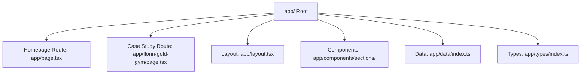

# Architecture Documentation

This document describes the high-level architecture and structure of the personal portfolio website.

## Technical Stack
*   **Framework**: Next.js (App Router)
*   **Library**: React
*   **Styling**: Tailwind CSS
*   **Language**: TypeScript

## Project Structure
The website is structured using Next.js App Router, split between the main homepage, a dedicated case study sub-route, modular UI sections, and type configurations.

### Key Directories & Files

*   **`app/layout.tsx`**: Defines the global HTML wrapper, meta tags, and global CSS imports.
*   **`app/page.tsx`**: Serves as the main coordinator for the landing page sections (Server Component).
*   **`app/florin-gold-gym/page.tsx`**: Dedicated case study page with gym-themed dark styling, local React-state carousel slider, and video container mockup.
*   **`app/components/navigation/`**: Navigation items:
    *   `Navbar.tsx`: Minimalist, transparent client-side navbar with a responsive mobile drawer menu and anchor smooth-scrolling links.
*   **`app/components/sections/`**: Modular layout blocks:
    *   `HeroSection.tsx`: Responsive 3-column split layout (Title on top-right, Subheading/CTAs on bottom-left, large bottom-anchored avatar centered).
    *   `ServicesSection.tsx`: Houses the three consulting pillars with centered contents directly below the Hero.
    *   `TechVectorSection.tsx`: Showcases the custom AI RAG capability (What I Can Build).
    *   `GymSection.tsx`: Highlights the mission-critical check-in & payment suite (Experience in Delivery).
    *   `KaizenSection.tsx`: Details startup lessons and business consultation values (Business Background).
    *   `PhoneMockup.tsx`: Sleek, dark distraction-free phone UI mockup displaying Kaizen screen metrics.
    *   `Footer.tsx`: Cleaned contact footer with the avatar image removed and contact mail standardized.
*   **`app/data/index.ts`**: Static copywriting data, subtitles, tags, and mockup details.
*   **`app/types/index.ts`**: TypeScript type safety definitions (e.g. `Project`, `AppUsageItem`).
