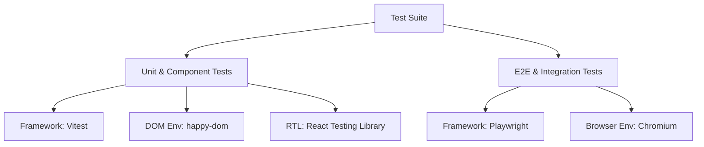

# Testing Guide

This document describes the testing framework set up for the `tudose_website` project, covering both unit tests, component tests, and end-to-end integration tests.

---

## Testing Strategy

To ensure code quality, UI stability, and feature correctness, the test suite is split into two complementary layers:



### 1. Unit & Component (Integration) Testing
* **Framework**: [Vitest](https://vitest.dev/)
* **Environment**: `happy-dom` (fast, lightweight browser/DOM emulator)
* **Helper**: `@testing-library/react` (React Testing Library)
* **Scope**: Individual utilities and custom React state-management hooks or helper functions.
* **Exclusion**: Vitest is explicitly configured to ignore files under the `tests/` directory (where E2E specs live) to avoid runner runtime clashes.
* **Test Location**: Placed alongside the implementation files (e.g., `app/**/*.test.ts`).

### 2. End-to-End (E2E) Browser Integration Testing
* **Framework**: [Playwright](https://playwright.dev/)
* **Environment**: Real browser environments (defaults to Chromium)
* **Scope**: Core user navigation flows, verifying that elements load correctly, testing Next.js router transitions (between the homepage `/` and the case study page `/florin-gold-gym`), and checking external links.
* **Test Location**: Placed in the dedicated `tests/` directory at the project root (e.g., `tests/navigation.spec.ts`).

---

## Configuration Files

* **`vitest.config.mts`**: Registers the React and `tsconfigPaths` plugins, sets the environment to `happy-dom`, and excludes `tests/**` (Playwright tests) from the Vitest runtime:
  ```typescript
  exclude: [...configDefaults.exclude, "tests/**"]
  ```
* **`vitest.setup.ts`**: Configures global mocks required for Virtual DOM tests:
  * Mocking `window.scrollTo` (not supported natively in happy-dom).
  * Mocking `next/image` to render as a plain HTML `` tag for ease of attribute assertions.
* **`playwright.config.ts`**: Configures Playwright's test directory (`tests/`), local webServer details (`npm run dev` with reuse of existing server if active), and target browser profiles.

---

## Running Tests

### Unit & Component Tests

```bash
# Run Vitest tests once
npm run test

# Run Vitest in watch mode (ideal during development)
npm run test:watch
```

### E2E Integration Tests

Make sure the dev server is running, or let Playwright start it automatically:

```bash
# Run E2E tests against Chromium (headless by default)
npm run test:e2e

# Run Playwright tests with the interactive UI runner
npx playwright test --ui
```

---

## E2E Test Example: Navigation & Static Makeover

Our primary E2E test file (`tests/navigation.spec.ts`) verifies the structure of the personal portfolio website and links:

```typescript
import { test, expect } from "@playwright/test";

test.describe("Portfolio Navigation & Static Makeover", () => {
  test("should render the home page copy and navigate to Florin Gold Gym case study", async ({ page }) => {
    // 1. Visit the home page
    await page.goto("/");

    // 2. Verify homepage headline and humbler, business-focused copy
    await expect(page.locator("h1")).toContainText("Turn manual tasks into seamless, automated workflows.");
    await expect(page.locator("text=Hi, I'm Stefan.")).toBeVisible();
    await expect(page.locator("text=I translate complex technical problems into simple, reliable software solutions for growing businesses.")).toBeVisible();

    // 3. Verify that the three projects are present in the list
    await expect(page.locator("text=TechVector").first()).toBeVisible();
    await expect(page.locator("text=Florin Gold Gym").first()).toBeVisible();
    await expect(page.locator("text=Kaizen").first()).toBeVisible();

    // 4. Verify that Kaizen startup story has its own repurposed section
    await expect(page.locator("text=Thinking like a founder: Why you need a partner, not just a contractor")).toBeVisible();

    // 5. Navigate to the Florin Gold Gym page by clicking the project card
    const florinGymLink = page.locator("a[href='/florin-gold-gym']");
    await expect(florinGymLink).toBeVisible();
    await florinGymLink.click();

    // 6. Verify URL has changed to /florin-gold-gym
    await expect(page).toHaveURL(/\/florin-gold-gym/);

    // 7. Verify Florin Gold Gym case study title & content
    await expect(page.locator("h1")).toContainText("Florin Gold Gym: Building a System an Entire Business Bets Its Life On.");
    await expect(page.locator("text=The Stakes: Real-World Dependency")).toBeVisible();
    await expect(page.locator("text=Client Testimonial Video")).toBeVisible();

    // 8. Test back button links back to the main portfolio page
    const backBtn = page.locator("text=Back to Portfolio");
    await expect(backBtn).toBeVisible();
    await backBtn.click();

    // 9. Verify we are back on the homepage
    await expect(page).toHaveURL(/\/$/);
  });
});
```
