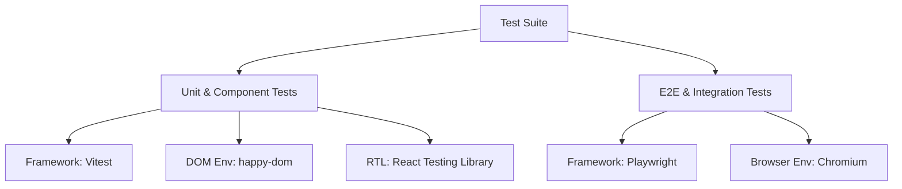

# Testing Guide

This document describes the testing framework set up for the `tudose_website` project, covering both unit tests, component tests, and end-to-end integration tests.

---

## Testing Strategy

To ensure code quality, UI stability, and feature correctness, the test suite is split into two complementary layers:



### 1. Unit & Component (Integration) Testing
* **Framework**: [Vitest](https://vitest.dev/)
* **Environment**: `happy-dom` (fast, lightweight browser/DOM emulator)
* **Helper**: `@testing-library/react` (React Testing Library)
* **Scope**: Custom React hooks (like `useChat.ts`), utility helper functions, and individual React components (like `ChatWidget.tsx` and `TypingIndicator.tsx`).
* **Test Location**: Placed alongside the implementation files (e.g. `app/hooks/useChat.test.ts` or `app/components/chat/ChatWidget.test.tsx`).

### 2. End-to-End (E2E) Browser Integration Testing
* **Framework**: [Playwright](https://playwright.dev/)
* **Environment**: Real browser environments (defaults to Chromium)
* **Scope**: Full multi-component flows, page rendering, focus management, network interactions, and real browser scrolling/animations.
* **Test Location**: Placed in the dedicated `tests/` directory at the project root (e.g. `tests/chat-integration.spec.ts`).

---

## Configuration Files

* **`vitest.config.mts`**: Registers the React plugin and `tsconfigPaths` plugin (enabling path resolution like `@/*`), sets the environment to `happy-dom`, and references the setup file.
* **`vitest.setup.ts`**: Configures global mocks required for jsdom/happy-dom testing, such as:
  * Mocking `window.scrollTo` (since layout scroll methods are not natively supported in virtual DOMs).
  * Mocking `next/image` to render as a plain HTML `` tag for ease of attribute assertions.
* **`playwright.config.ts`**: Configures Playwright's target folder (`tests/`), local webServer details (`npm run dev` with reuse of existing server if running), and target browser profiles.

---

## Running Tests

Verify your implementation by running the respective npm scripts:

### Unit & Component Tests

```bash
# Run all Vitest tests once
npm run test

# Run Vitest in watch mode (ideal during development)
npm run test:watch
```

### E2E Integration Tests

Make sure the dev server is running or let Playwright start it automatically:

```bash
# Run E2E tests against Chromium (headless by default)
npm run test:e2e

# Run Playwright tests with the interactive UI runner (highly recommended for debugging)
npx playwright test --ui
```

---

## Writing New Tests

### 1. Writing a Unit Test (Vitest)
Create a `.test.ts` or `.test.tsx` file next to your target module. Use standard `describe`, `it`, and `expect` syntax.

Example (testing a utility):
```typescript
import { describe, it, expect } from "vitest";
import { formatTime } from "./utils";

describe("formatTime", () => {
  it("formats date to YYYY-MM-DD", () => {
    const date = new Date("2026-07-11T12:00:00Z");
    expect(formatTime(date)).toBe("2026-07-11");
  });
});
```

### 2. Writing a Component Test (React Testing Library)
Use React Testing Library's `render` and `screen` utilities to verify interactive behaviors.

Example:
```typescript
import { render, screen, fireEvent } from "@testing-library/react";
import { Button } from "./Button";
import { vi, describe, it, expect } from "vitest";

describe("Button", () => {
  it("triggers click handler", () => {
    const handleClick = vi.fn();
    render(<Button onClick={handleClick}>Click Me</Button>);
    
    fireEvent.click(screen.getByText("Click Me"));
    expect(handleClick).toHaveBeenCalledOnce();
  });
});
```

### 3. Writing an Integration Test (Playwright)
Create a `.spec.ts` file in the `tests/` directory. Use Playwright's `test` and `expect` assertions.

Example:
```typescript
import { test, expect } from "@playwright/test";

test("should load the home page", async ({ page }) => {
  await page.goto("/");
  await expect(page.locator("h1")).toContainText("Stefan Tudose");
});
```
